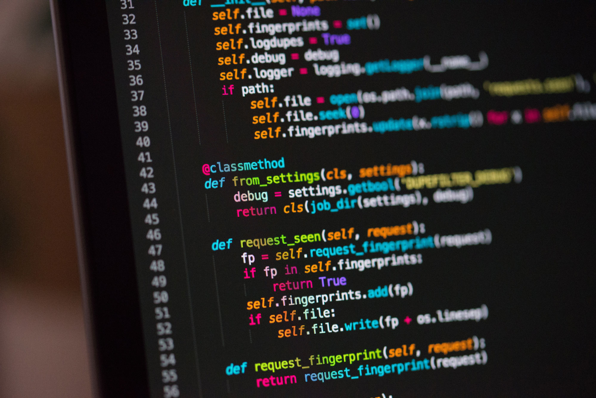

I started out in web development creating websites for businesses, and later moved into custom web apps. Node, React and MySQL are my tools of choice, and I'm very interested in integrating GraphQL in the near future. I like these tools for there speed of development and their thriving ecosystems.

Software development is well suited for lifelong learners. I earned a B.S. in Applied Computing Technology at Colorado State University and continue to learn in my own time to expand my skillset. I try to let real world problems I encounter at work guide my topic of study. Some topics I'm likely to dive into in the near future are data intensive design, and golang.

I'm always looking for some good self education material, so let me know if a good book or course impacted you. Some books that have most recently influenced my career are Clean Code and Extreme Ownership.

